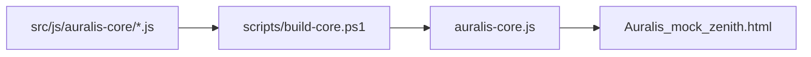

# Auralis Runtime Architecture

## Plain-English Summary

Auralis still runs as one browser script, but the source is split into ordered shards so people and agents can edit smaller pieces safely. The generated `auralis-core.js` file is rebuilt from those shards and should not be edited directly.

The DeepSeek refactor document is the north star. The current strategy is staged: first add guardrails, then move state, persistence, rendering, and performance work into clearer modules over time.

## Current Flow

## Current Shard Groups

| Area | Current files | Responsibility |
| --- | --- | --- |
| Shell and shared helpers | `00-shell-state-helpers.js` | Opens the runtime scope, shared constants, diagnostics, storage helpers, shared text, action sheets, album progress, playable URLs. |
| Library and metadata | `01-library-scan-metadata.js`, `05-media-folder-idb.js`, `12-metadata-editor.js`, `13-m3u-io.js` | Builds library data, scans files, parses metadata, edits track data, imports and exports playlists. |
| Playback | `03-playback-engine.js` | Audio element, transport controls, progress, active rows. |
| Views and components | `04-navigation-renderers.js`, `07-zenith-config-profiles.js`, `08-zenith-components.js`, `09-zenith-home-sections.js`, `10-zenith-library-views.js` | Screens, cards, rows, home sections, library views, profile behavior. |
| Setup and compatibility | `02-layout-favorites-hydration.js`, `06-setup-init-a11y.js`, `11-events-compat.js` | Hydration, onboarding, accessibility, delegated events, legacy API, runtime verification hook. |
| Backend | `14-backend-integration.js` | Login, sync, metrics, remote sessions. |

## North-Star Direction

Future slices should move toward:

- One central state store with disciplined updates.
- IndexedDB for large user and library data.
- One row factory and one collection-card factory.
- Unified metadata parsing.
- Viewport-aware rendering for large lists.
- Central logging and debug visibility.
- Smaller shards with clearer ownership.

## Current Foundation Guardrails

- `AuralisDiagnostics` records warnings and errors in memory.
- `AuralisStrings` gives shared text one home as the refactor expands.
- `safeStorage` reports blocked storage and large writes.
- `window.Auralis.__runVerification()` exposes a small runtime health report.
- `scripts/verify-criteria.js` separates current pass/fail checks from future north-star warnings.
