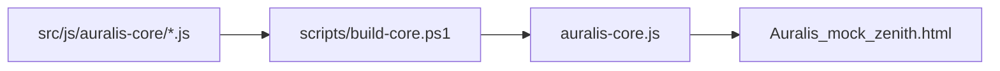

# Runtime Foundation Refactor Implementation Plan

> **For agentic workers:** REQUIRED SUB-SKILL: Use superpowers:subagent-driven-development (recommended) or superpowers:executing-plans to implement this plan task-by-task. Steps use checkbox (`- [ ]`) syntax for tracking.

**Goal:** Build the first safe foundation slice from the DeepSeek north-star refactor: central runtime logging, safer storage warnings, shared strings, architecture docs, and a verification script.

**Architecture:** Keep the current single-IIFE bundle and filename-ordered concatenation. Add tiny early-loading shards for diagnostics and strings, then make the existing safe storage wrapper report failures without changing saved data formats or user-visible behavior.

**Tech Stack:** Plain browser JavaScript, PowerShell bundle script, Node CommonJS verification script, existing npm scripts.

---

## File Structure

- Create `src/js/auralis-core/00a-runtime-logger.js`: Central in-memory logger and verification hook namespace.
- Create `src/js/auralis-core/00b-strings.js`: First shared user-facing strings object for foundation warnings and future UI text.
- Modify `src/js/auralis-core/00-shell-state-helpers.js`: Route `safeStorage` failures and oversized writes through the logger while preserving its public methods.
- Create `docs/runtime-architecture.md`: Plain-English map of current shards, north-star target, and staged refactor path.
- Modify `src/js/auralis-core/README.md`: Link to the new architecture doc and document the new early shards.
- Create `scripts/verify-criteria.js`: North-star verification report with pass/warn/fail sections.
- Modify `package.json`: Add `verify:criteria` script.
- Modify generated `auralis-core.js`: Rebuild from source shards only.

---

### Task 1: Add The Runtime Logger Shard

**Files:**
- Create: `src/js/auralis-core/00a-runtime-logger.js`

- [ ] **Step 1: Create the logger shard**

Add this file:

```javascript
/*
 * Auralis JS shard: 00a-runtime-logger.js
 * Purpose: Central runtime diagnostics used by storage, verification, and future debug UI.
 */
    const AURALIS_LOG_LIMIT = 250;
    const AuralisDiagnostics = (() => {
        const entries = [];

        function normalizeLevel(level) {
            return ['debug', 'info', 'warn', 'error'].includes(level) ? level : 'info';
        }

        function normalizeError(error) {
            if (!error) return null;
            if (error instanceof Error) {
                return { name: error.name, message: error.message, stack: error.stack || '' };
            }
            return { name: 'NonError', message: String(error), stack: '' };
        }

        function write(level, message, details) {
            const entry = Object.freeze({
                level: normalizeLevel(level),
                message: String(message || 'Auralis diagnostic event'),
                details: details || null,
                timestamp: Date.now()
            });
            entries.push(entry);
            if (entries.length > AURALIS_LOG_LIMIT) entries.shift();
            return entry;
        }

        function log(level, message, details) {
            return write(level, message, details || null);
        }

        function warn(message, details) {
            return write('warn', message, details || null);
        }

        function error(message, errorValue, details) {
            return write('error', message, Object.assign({}, details || {}, {
                error: normalizeError(errorValue)
            }));
        }

        function snapshot() {
            return entries.slice();
        }

        function clear() {
            entries.splice(0, entries.length);
        }

        return Object.freeze({ log, warn, error, snapshot, clear });
    })();

    const AuralisStrings = {};
    const AuralisRuntime = {
        diagnostics: AuralisDiagnostics,
        strings: AuralisStrings
    };
```

- [ ] **Step 2: Confirm build order**

Run:

```powershell
Get-ChildItem -LiteralPath src/js/auralis-core -Filter '*.js' | Sort-Object Name | Select-Object -First 4 Name
```

Expected: `00-shell-state-helpers.js` appears before `00a-runtime-logger.js`. Because the existing shell file opens the IIFE, this is correct: the new logger lives inside that same IIFE after the shell begins.

---

### Task 2: Add Shared Strings Shard

**Files:**
- Create: `src/js/auralis-core/00b-strings.js`

- [ ] **Step 1: Create the strings shard**

Add this file:

```javascript
/*
 * Auralis JS shard: 00b-strings.js
 * Purpose: Shared user-facing and diagnostic text for the runtime.
 */
    Object.assign(AuralisStrings, {
        storageReadFailed: 'Browser storage could not be read.',
        storageWriteFailed: 'Browser storage could not be updated.',
        storageRemoveFailed: 'Browser storage entry could not be removed.',
        storageClearFailed: 'Browser storage cleanup could not remove an entry.',
        storageJsonParseFailed: 'Saved browser storage data could not be parsed.',
        storageJsonStringifyFailed: 'Saved browser storage data could not be prepared.',
        storageLargeWrite: 'A large browser storage write was detected.',
        verificationReady: 'Auralis runtime verification is available.'
    });
```

- [ ] **Step 2: Verify no hard dependency on DOM**

Run:

```powershell
Select-String -LiteralPath src/js/auralis-core/00b-strings.js -Pattern 'document','window','querySelector'
```

Expected: no matches.

---

### Task 3: Route Safe Storage Through Diagnostics

**Files:**
- Modify: `src/js/auralis-core/00-shell-state-helpers.js`

- [ ] **Step 1: Replace the existing `safeStorage` object**

In `src/js/auralis-core/00-shell-state-helpers.js`, replace the current `safeStorage` object with this version:

```javascript
    const LOCAL_STORAGE_WARN_BYTES = 1024;

    function estimateStorageBytes(value) {
        return new Blob([String(value == null ? '' : value)]).size;
    }

    function reportStorageIssue(level, messageKey, details, error) {
        const message = AuralisStrings[messageKey] || messageKey;
        if (level === 'error') {
            AuralisDiagnostics.error(message, error, details);
            return;
        }
        AuralisDiagnostics.warn(message, details || null);
    }

    function warnIfLargeStorageWrite(key, value) {
        const byteSize = estimateStorageBytes(value);
        if (byteSize <= LOCAL_STORAGE_WARN_BYTES) return;
        reportStorageIssue('warn', 'storageLargeWrite', { key, byteSize }, null);
    }

    // Safe localStorage wrapper (handles private browsing / quota exceeded)
    const safeStorage = {
        getItem(key) {
            try {
                return localStorage.getItem(key);
            } catch (error) {
                reportStorageIssue('warn', 'storageReadFailed', { key }, error);
                return null;
            }
        },
        setItem(key, value) {
            try {
                warnIfLargeStorageWrite(key, value);
                localStorage.setItem(key, value);
            } catch (error) {
                reportStorageIssue('error', 'storageWriteFailed', { key }, error);
            }
        },
        removeItem(key) {
            try {
                localStorage.removeItem(key);
            } catch (error) {
                reportStorageIssue('warn', 'storageRemoveFailed', { key }, error);
            }
        },
        clearKnownKeys() {
            Object.values(STORAGE_KEYS).forEach((key) => {
                try {
                    localStorage.removeItem(key);
                } catch (error) {
                    reportStorageIssue('warn', 'storageClearFailed', { key }, error);
                }
            });
        },
        getJson(key, fallback) {
            try {
                const raw = localStorage.getItem(key);
                if (!raw) return fallback;
                return JSON.parse(raw);
            } catch (error) {
                reportStorageIssue('warn', 'storageJsonParseFailed', { key }, error);
                return fallback;
            }
        },
        setJson(key, value) {
            try {
                const serialized = JSON.stringify(value);
                warnIfLargeStorageWrite(key, serialized);
                localStorage.setItem(key, serialized);
            } catch (error) {
                reportStorageIssue('error', 'storageJsonStringifyFailed', { key }, error);
            }
        }
    };
```

- [ ] **Step 2: Guard older browser support for byte estimation if needed**

If a verification run shows `Blob` is unavailable in the Node/browser-like environment, replace `estimateStorageBytes` with:

```javascript
    function estimateStorageBytes(value) {
        const text = String(value == null ? '' : value);
        if (typeof Blob === 'function') return new Blob([text]).size;
        return text.length;
    }
```

- [ ] **Step 3: Confirm the public method names are unchanged**

Run:

```powershell
Select-String -LiteralPath src/js/auralis-core/00-shell-state-helpers.js -Pattern 'getItem\\(key\\)','setItem\\(key, value\\)','removeItem\\(key\\)','clearKnownKeys\\(\\)','getJson\\(key, fallback\\)','setJson\\(key, value\\)'
```

Expected: all six method signatures appear.

---

### Task 4: Expose A Minimal Verification Hook

**Files:**
- Modify: `src/js/auralis-core/11-events-compat.js`

- [ ] **Step 1: Find the compatibility bridge**

Run:

```powershell
Select-String -LiteralPath src/js/auralis-core/11-events-compat.js -Pattern 'window.AuralisApp','Object.assign','AuralisApp'
```

Expected: the file contains the legacy global API bridge.

- [ ] **Step 2: Add a runtime namespace without changing `window.AuralisApp`**

Near the end of the bridge setup, add:

```javascript
    window.Auralis = window.Auralis || {};
    window.Auralis.diagnostics = AuralisDiagnostics;
    window.Auralis.__runVerification = function runRuntimeVerification() {
        const renderedNodes = document ? document.querySelectorAll('*').length : 0;
        return {
            ok: true,
            revision: Date.now(),
            renderedNodes,
            diagnostics: AuralisDiagnostics.snapshot(),
            stringsAvailable: Boolean(AuralisStrings.verificationReady)
        };
    };
```

- [ ] **Step 3: If `document` can be missing, harden the hook**

If the Node verification environment reports `document is not defined`, use this version instead:

```javascript
    window.Auralis = window.Auralis || {};
    window.Auralis.diagnostics = AuralisDiagnostics;
    window.Auralis.__runVerification = function runRuntimeVerification() {
        const renderedNodes = typeof document === 'undefined' ? 0 : document.querySelectorAll('*').length;
        return {
            ok: true,
            revision: Date.now(),
            renderedNodes,
            diagnostics: AuralisDiagnostics.snapshot(),
            stringsAvailable: Boolean(AuralisStrings.verificationReady)
        };
    };
```

---

### Task 5: Add Runtime Architecture Documentation

**Files:**
- Create: `docs/runtime-architecture.md`
- Modify: `src/js/auralis-core/README.md`

- [ ] **Step 1: Create `docs/runtime-architecture.md`**

Use this content:

```markdown
# Auralis Runtime Architecture

## Plain-English Summary

Auralis still runs as one browser script, but the source is split into ordered shards so people and agents can edit smaller pieces safely. The generated `auralis-core.js` file is rebuilt from those shards and should not be edited directly.

The DeepSeek refactor document is the north star. The current strategy is staged: first add guardrails, then move state, persistence, rendering, and performance work into clearer modules over time.

## Current Flow



## Current Shard Groups

| Area | Current files | Responsibility |
| --- | --- | --- |
| Shell and shared helpers | `00-shell-state-helpers.js`, `00a-runtime-logger.js`, `00b-strings.js` | Opens the runtime scope, shared constants, diagnostics, storage helpers, shared text. |
| Library and metadata | `01-library-scan-metadata.js`, `05-media-folder-idb.js`, `12-metadata-editor.js`, `13-m3u-io.js` | Builds library data, scans files, parses metadata, edits track data, imports and exports playlists. |
| Playback | `03-playback-engine.js` | Audio element, transport controls, progress, active rows. |
| Views and components | `04-navigation-renderers.js`, `07-zenith-config-profiles.js`, `08-zenith-components.js`, `09-zenith-home-sections.js`, `10-zenith-library-views.js` | Screens, cards, rows, home sections, library views, profile behavior. |
| Setup and compatibility | `02-layout-favorites-hydration.js`, `06-setup-init-a11y.js`, `11-events-compat.js` | Hydration, onboarding, accessibility, delegated events, legacy API. |
| Backend | `14-backend-integration.js` | Login, sync, metrics, remote sessions. |

## North-Star Direction

Future slices should move toward:

- One central state store with disciplined updates.
- IndexedDB for large user and library data.
- One row factory and one collection-card factory.
- Unified metadata parsing.
- Viewport-aware rendering for large lists.
- Central logging and debug visibility.
- Smaller shards with clearer ownership.

## Current Foundation Guardrails

- `AuralisDiagnostics` records warnings and errors in memory.
- `safeStorage` reports blocked storage and large writes.
- `scripts/verify-criteria.js` separates current pass/fail checks from future north-star warnings.
```

- [ ] **Step 2: Update `src/js/auralis-core/README.md` shard ownership**

Add these bullets after `00-shell-state-helpers.js`:

```markdown
- `00a-runtime-logger.js`: central runtime diagnostics and future debug-panel data.
- `00b-strings.js`: shared user-facing and diagnostic strings.
```

Add this short section after the rebuild instructions:

```markdown
## Architecture Notes

See `../../../docs/runtime-architecture.md` for the plain-English runtime map and staged refactor direction.
```

---

### Task 6: Add North-Star Verification Script

**Files:**
- Create: `scripts/verify-criteria.js`
- Modify: `package.json`

- [ ] **Step 1: Create `scripts/verify-criteria.js`**

Add a CommonJS script with these checks:

```javascript
const fs = require('fs');
const path = require('path');

const root = path.resolve(__dirname, '..');
const jsDir = path.join(root, 'src', 'js', 'auralis-core');
const cssDir = path.join(root, 'src', 'styles');

const requiredFiles = [
  'src/js/auralis-core/00a-runtime-logger.js',
  'src/js/auralis-core/00b-strings.js',
  'docs/runtime-architecture.md',
  'scripts/verify-criteria.js'
];

const results = [];

function add(status, code, message, details = '') {
  results.push({ status, code, message, details });
}

function read(relativePath) {
  return fs.readFileSync(path.join(root, relativePath), 'utf8');
}

function listFiles(dir, extension) {
  if (!fs.existsSync(dir)) return [];
  return fs.readdirSync(dir)
    .filter((name) => name.endsWith(extension))
    .map((name) => path.join(dir, name));
}

function countLines(text) {
  return text.split(/\r?\n/).length;
}

function checkRequiredFiles() {
  requiredFiles.forEach((file) => {
    const exists = fs.existsSync(path.join(root, file));
    add(exists ? 'PASS' : 'FAIL', 'FOUNDATION_FILE', `${file} exists`);
  });
}

function checkShardSizes() {
  listFiles(jsDir, '.js').forEach((file) => {
    const lines = countLines(fs.readFileSync(file, 'utf8'));
    const relative = path.relative(root, file);
    add(lines <= 500 ? 'PASS' : 'WARN', 'S7_SHARD_SIZE', `${relative} has ${lines} lines`, 'North-star target is <= 500 lines.');
  });
}

function checkCssImportant() {
  let count = 0;
  listFiles(cssDir, '.css').forEach((file) => {
    const text = fs.readFileSync(file, 'utf8');
    count += (text.match(/!important/g) || []).length;
  });
  add(count === 0 ? 'PASS' : 'WARN', 'S34_IMPORTANT', `${count} CSS !important declarations found`, 'Known future styling cleanup target.');
}

function checkStorageGuard() {
  const shell = read('src/js/auralis-core/00-shell-state-helpers.js');
  add(shell.includes('LOCAL_STORAGE_WARN_BYTES') ? 'PASS' : 'FAIL', 'S4_STORAGE_GUARD', 'localStorage size warning guard is present');
  add(shell.includes('warnIfLargeStorageWrite') ? 'PASS' : 'FAIL', 'S4_STORAGE_WARN', 'large localStorage writes are reported');
  add(shell.includes('AuralisDiagnostics') ? 'PASS' : 'FAIL', 'S31_STORAGE_LOGGING', 'safeStorage routes issues through diagnostics');
}

function checkSilentCatchBlocks() {
  const offenders = [];
  listFiles(jsDir, '.js').forEach((file) => {
    const text = fs.readFileSync(file, 'utf8');
    const matches = text.match(/catch\s*\([^)]*\)\s*\{\s*\}/g) || [];
    if (matches.length) offenders.push(`${path.relative(root, file)} (${matches.length})`);
  });
  add(offenders.length === 0 ? 'PASS' : 'WARN', 'S31_SILENT_CATCH', offenders.length ? offenders.join(', ') : 'No empty catch blocks found', 'Known future robustness cleanup target.');
}

function checkRuntimeHook() {
  const compat = read('src/js/auralis-core/11-events-compat.js');
  add(compat.includes('__runVerification') ? 'PASS' : 'FAIL', 'RUNTIME_HOOK', 'window.Auralis.__runVerification hook is present');
}

function printResults() {
  const order = { FAIL: 0, WARN: 1, PASS: 2 };
  results.sort((a, b) => order[a.status] - order[b.status] || a.code.localeCompare(b.code));
  results.forEach((result) => {
    const detail = result.details ? ` (${result.details})` : '';
    console.log(`[${result.status}] ${result.code}: ${result.message}${detail}`);
  });
  const failures = results.filter((result) => result.status === 'FAIL');
  const warnings = results.filter((result) => result.status === 'WARN');
  console.log('');
  if (failures.length) {
    console.log(`VERIFICATION FAILED: ${failures.length} failure(s), ${warnings.length} warning(s).`);
    process.exitCode = 1;
    return;
  }
  console.log(`FOUNDATION CHECKS PASSED: ${warnings.length} north-star warning(s) remain.`);
}

checkRequiredFiles();
checkShardSizes();
checkCssImportant();
checkStorageGuard();
checkSilentCatchBlocks();
checkRuntimeHook();
printResults();
```

- [ ] **Step 2: Add npm script**

In `package.json`, add:

```json
"verify:criteria": "node scripts/verify-criteria.js",
```

Place it near the other check scripts so the scripts section stays readable.

- [ ] **Step 3: Run verification and confirm expected warnings only**

Run:

```powershell
npm run verify:criteria
```

Expected: no `FAIL` lines. Warnings are expected for existing oversized shards, CSS `!important`, and any pre-existing silent catches outside this slice.

---

### Task 7: Rebuild And Run Local Proofs

**Files:**
- Modify: `auralis-core.js`

- [ ] **Step 1: Rebuild generated bundle**

Run:

```powershell
npm run build
```

Expected: build reports that `auralis-core.js` was rebuilt from source shards.

- [ ] **Step 2: Confirm generated-file discipline**

Run:

```powershell
npm run check:generated
```

Expected: pass, meaning generated output matches source shards.

- [ ] **Step 3: Run server tests**

Run:

```powershell
npm test
```

Expected: all existing Node tests pass.

- [ ] **Step 4: Run foundation verification**

Run:

```powershell
npm run verify:criteria
```

Expected: `FOUNDATION CHECKS PASSED` with warnings only for known north-star gaps.

---

### Task 8: Browser Validation

**Files:**
- No source changes expected.

- [ ] **Step 1: Start the local app**

Run:

```powershell
npm start
```

Expected: backend starts and serves the static app.

- [ ] **Step 2: Open the app with Codex Browser use**

Open:

```text
http://localhost:3000/Auralis_mock_zenith.html
```

Expected: the player loads without a blank screen or startup error.

- [ ] **Step 3: Check runtime verification in the browser console**

Evaluate:

```javascript
window.Auralis.__runVerification()
```

Expected shape:

```javascript
{
  ok: true,
  renderedNodes: 1,
  diagnostics: [],
  stringsAvailable: true
}
```

The exact `renderedNodes` value can be higher than `1`.

---

### Task 9: Commit, Tag, And Push

**Files:**
- All modified files from Tasks 1-8.

- [ ] **Step 1: Review changed files**

Run:

```powershell
git status --short
git diff --stat
```

Expected changed paths:

```text
auralis-core.js
docs/runtime-architecture.md
docs/superpowers/plans/2026-04-25-runtime-foundation-refactor.md
package.json
scripts/verify-criteria.js
src/js/auralis-core/00-shell-state-helpers.js
src/js/auralis-core/00a-runtime-logger.js
src/js/auralis-core/00b-strings.js
src/js/auralis-core/11-events-compat.js
src/js/auralis-core/README.md
```

- [ ] **Step 2: Create a snapshot tag before commit**

Run:

```powershell
git tag -a snapshot-20260425-runtime-foundation-pre-implementation -m "Snapshot before runtime foundation implementation"
```

Expected: tag is created locally.

- [ ] **Step 3: Commit the implementation**

Run:

```powershell
git add -- auralis-core.js docs/runtime-architecture.md docs/superpowers/plans/2026-04-25-runtime-foundation-refactor.md package.json scripts/verify-criteria.js src/js/auralis-core/00-shell-state-helpers.js src/js/auralis-core/00a-runtime-logger.js src/js/auralis-core/00b-strings.js src/js/auralis-core/11-events-compat.js src/js/auralis-core/README.md
git commit -m "Add runtime foundation refactor guardrails"
```

Expected: one implementation commit.

- [ ] **Step 4: Push branch and tag**

Run:

```powershell
git push origin experimental
git push origin snapshot-20260425-runtime-foundation-pre-implementation
```

Expected: branch and tag are pushed.

---

## Self-Review Notes

- Spec coverage: every approved foundation item is represented by a task.
- Scope control: the plan does not replace state, IndexedDB persistence, renderer factories, virtualization, CSS cascade, or HTML structure.
- Risk control: `safeStorage` keeps the same public method names and storage keys.
- Known warnings: the verification script is designed to report existing north-star gaps as warnings, not as false failures.
