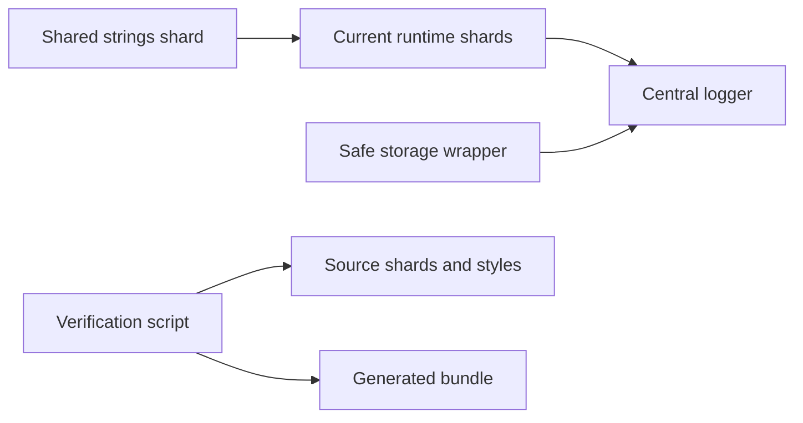
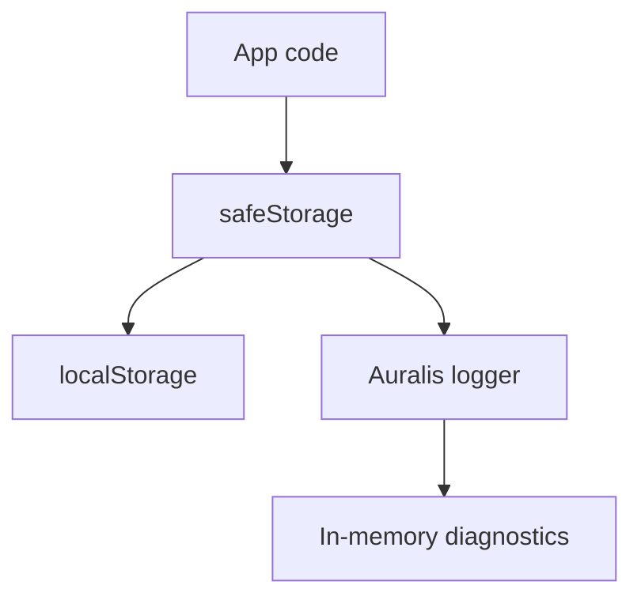

# Runtime Foundation Refactor Design

## Plain-English Summary

This first refactor pass uses the DeepSeek document as a north star, not as a single giant pass/fail rewrite. The goal is to make the player safer to change before we start moving larger pieces around.

The visible music player should behave the same after this work. The change is mostly in the engine room: clearer runtime documentation, safer storage behavior, central error logging, a first home for shared user-facing text, and a verification script that tells us where the codebase is improving and where larger future refactors are still needed.

## Why This Matters

The current JavaScript runtime works, but many important responsibilities are packed into very large shard files. The DeepSeek document correctly points out long-term risks: scattered state, localStorage pressure, repeated DOM-building patterns, silent error handling, and weak automated verification.

Trying to solve all of that in one commit would be risky because playback, scanning, queue handling, navigation, and backend sync all share one concatenated browser scope. This design starts with guardrails instead. Those guardrails make future refactors easier to prove and safer to ship.

## Scope

This slice will:

- Add a runtime architecture README for the current shard layout and the north-star target layout.
- Add a central logger that can collect warnings and errors for future debug-panel work.
- Route the existing safe localStorage wrapper through the logger.
- Add a size guard for localStorage writes so oversized JSON-style payloads are warned about instead of being invisible.
- Add a small `strings` shard for shared user-facing text touched by this pass.
- Add a verification script that checks the first enforceable refactor criteria and reports clear pass/warn/fail output.
- Rebuild `auralis-core.js` from source shards.
- Run the smallest reliable proof after implementation.

This slice will not:

- Replace the current global state model with a full central store yet.
- Move all large data from localStorage into IndexedDB yet.
- Virtualize every large list yet.
- Rewrite all renderer factories yet.
- Remove every CSS `!important` yet.
- Change the HTML shell.
- Change user-visible playback, scanning, queue, search, library, setup, or sync behavior.

## Architecture

The current app remains a plain JavaScript bundle built by concatenating files in `src/js/auralis-core/`.

For this slice, the architecture change is intentionally small:

The logger becomes the shared place for recoverable warnings and real errors. The storage wrapper uses it when browser storage fails or when a write appears too large. The verification script gives us a repeatable status report before and after future refactors.

## New Or Changed Files

Expected new files:

- `src/js/auralis-core/00a-runtime-logger.js`
- `src/js/auralis-core/00b-strings.js`
- `docs/runtime-architecture.md`
- `scripts/verify-criteria.js`

Expected changed files:

- `src/js/auralis-core/00-shell-state-helpers.js`
- `src/js/auralis-core/README.md`
- `package.json`
- `auralis-core.js` after rebuild

File names may be adjusted during implementation if the existing shard order makes another name cleaner, but the intent stays the same.

## Data Flow

Storage flow after this slice:

The app will still use the same storage keys and data formats. The difference is that failures and suspicious large writes become visible in one place.

## Error Handling

This slice does not rewrite every `try/catch` block. It starts enforcing the policy in the code it touches:

- Storage failures are logged.
- Known harmless storage failures are marked as recoverable.
- Oversized localStorage writes produce a warning with the key name and byte estimate.
- The verification script reports silent catch blocks so future slices can remove them in a controlled way.

## Verification

The verification script should check:

- JavaScript shard line counts.
- CSS `!important` usage count.
- direct edits to generated output warnings where detectable.
- localStorage write patterns.
- silent catch blocks.
- existence of the logger, strings shard, architecture README, and runtime verification hook if added.

Because this is a north-star slice, the script should distinguish between:

- `PASS`: criteria this slice is expected to satisfy now.
- `WARN`: known north-star gaps that remain for future staged refactors.
- `FAIL`: regressions or missing deliverables from this slice.

The script should not pretend the whole DeepSeek target is complete.

## What Could Break

The sensitive area is browser storage. If the storage wrapper changes behavior too much, saved preferences, favorites, queue state, or library hydration could behave differently.

To reduce that risk, implementation should preserve the current `safeStorage` public shape and existing key names. Logging should be additive. The app should still degrade gracefully when localStorage is blocked.

## Recommended Next Step

After this design is approved, write an implementation plan for the foundation slice, then implement it in source shards only. Rebuild the generated bundle, run the new verification script, run the existing generated-file check, and run the smallest relevant app proof.

## Bottom Line

This is a foundation pass. It does not claim to finish the DeepSeek refactor. It creates safer footing so the next slices can tackle state, persistence, renderer reuse, and list performance with better visibility and lower risk.
